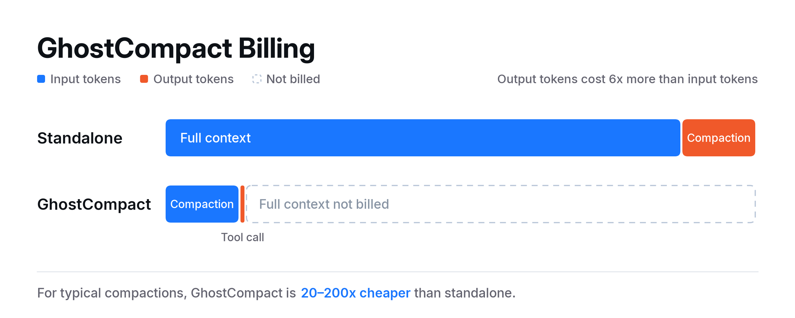
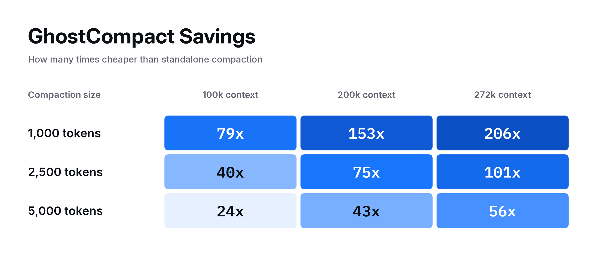
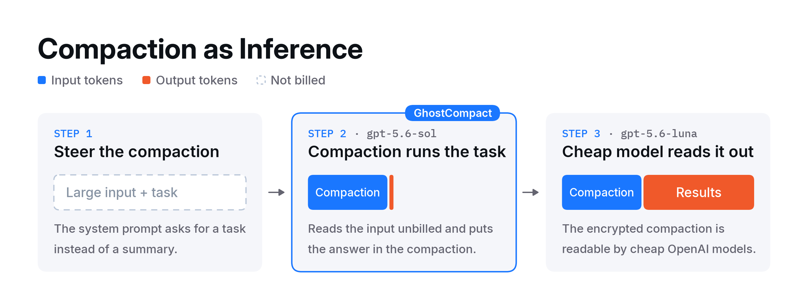

# GhostCompact: How Compaction Made OpenAI Inference Nearly Free

Tim Becker (@tjbecker) - Xint Researcher

## Summary

In August 2026, Xint researchers discovered an accounting logic bug in the OpenAI API. Dubbed GhostCompact, the bug could be abused to extract nearly-free inference from frontier OpenAI models. OpenAI confirmed the issue and deployed a fix on September 21, 2026. The Xint team was rewarded with a $600 bounty.

## Background

All current LLMs have some fixed upper context limit. To prevent long running conversations or agent loops from outright failing, AI tools instead use a technique known as compaction. Compaction uses an AI model to reduce context size while preserving the important state needed for subsequent turns. The OpenAI Responses API offers two ways to compact the context:

* Standalone compaction: hit `/responses/compact` with your full history, receive a compaction item back.
* Inline compaction: enabled per request with `context_management=[{"type": "compaction", "compact_threshold": N}]`. When the input tokens cross N, the server auto-compacts the input and returns an opaque compaction item alongside new output items.

Standalone compaction is billed like a normal model request: you pay input tokens for the history and output tokens for the compaction item. However, inline compaction has some major billing discrepancies.

## The bug

Inline compactions followed by a tool call were billed incorrectly. When the model's first action after compacting was a tool call, the API billed only for the post-compaction tokens, but the tool call response still contained the full compaction item. Note that when a regular message followed instead, the full input was billed as expected.

We isolated this with a controlled test. We sent the same ~200k-token input, varying only whether the model replied with a message or a tool call:

| Model's next output | Billed input tokens |
| :-: | :-: |
| Message | 200,749 |
| Tool call | 300 |

The billing discrepancy held for inputs of all sizes, at different reasoning effort levels, for streaming and non-streaming requests, with and without prompt caching, etc. Furthermore, the response’s reported token usage matched the organization-level Usage API exactly, so these were the amounts actually billed, not just a reporting glitch.

This bug meant a client could directly substitute a `/responses/compact` call with an inline compaction request that forced a tool call (via `tool_choice`) and receive an equivalent result for a tiny fraction of the cost.

[ghost_compact.py](ghost_compact.py) demonstrates this, comparing the billing of all three ways to compact.

How much cheaper this is depends on both the input context size and the compaction size. For contexts of 100-272k tokens and compactions of 1-5k tokens, GhostCompact was 20–200x cheaper than standalone compaction.

This bug can also be triggered accidentally by anyone using inline compactions. In agent loops (where the step after compaction is usually a tool call) we'd expect this bug to trigger regularly. Inline compaction is opt-in in most agent frameworks, but a few popular tools (including OpenClaw) enable it by default.

## How we found it

While refactoring Xint’s internal agent harness to use inline compactions rather than standalone compactions, Xint researchers noticed the unusual billing discrepancy. At first, GhostCompact may seem like a minor business logic issue, but the full security implications only emerge when you consider its potential for abuse.

## From compactions to inference

Is it really a big deal to get nearly free compactions? Yes, because compactions can perform arbitrary inference! OpenAI does not document how their compaction actually works, but the public evidence suggests compaction is a specialized inference pass whose output just happens to be an opaque, encrypted blob.

Although intended to be used for summarization, the compaction step is highly steerable via the system prompt, so we can instead instruct it to perform any arbitrary inference task over its input and put the output in the compaction blob. Then, some other cheap model can receive the compaction blob and render out the results contained inside.

If GhostCompact is used for the compaction step, this inference method is ripe for abuse. As a demonstration, we built a full-codebase security scanner called GhostScan, available in [ghost_scan.py](ghost_scan.py). Across a few scans, GhostScan found genuine 0-day vulnerabilities in critical open source software, including [CVE-2026-84783](https://openssl-library.org/news/secadv/20260929.txt) in OpenSSL, clearly demonstrating the practical utility of abusing compaction as inference. In our testing, GhostScan had an average discount of 40x relative to the equivalent raw inference costs.
